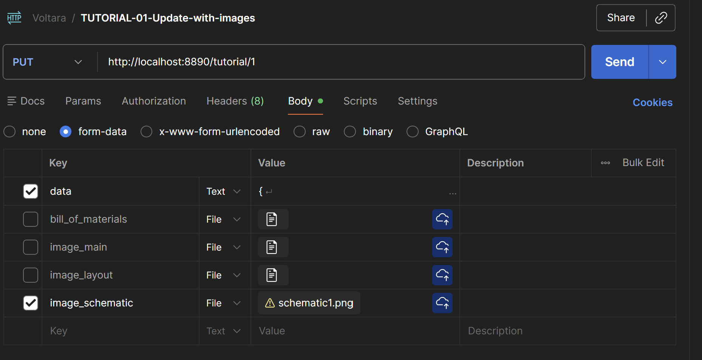

## Voltara - Back-end App

Last updated on: 26-Jan-2026

<hr>

### List of Tables
- users
- category
- tutorial
- upload
- image

### API End-points detail

### Users Table
| No# | Feature | Filter | Return Value | HTTP Method | End-point URL | Argument to pass|
|:--:|:--|:--:|:--|:--|:--|:--:|
|1| Create a user | - | Object of the newly created user | POST | http://localhost:8890/user | - |
|2|Get a user | by user id | User object | GET | http://localhost:8890/user/{id} | {id} is user id |
|3|Get the list of all users | - | List of all user objects | GET | http://localhost:8890/user | - |
|4|Update a user | by user id | Object of the newly updated user | PUT | http://localhost:8890/user/{id} | {id} is user id |
|5|Delete a user | by user id | Object of the newly deleted user | DELETE | http://localhost:8890/user/{id} | {id} is user id |

## Tutorial Table
| No# | Feature                                                        |                 Filter                  | Return Value                                      | HTTP Method | End-point URL                                                                   |  Argument to pass   |
|:---:|:---------------------------------------------------------------|:---------------------------------------:|:--------------------------------------------------|:-----------:|:--------------------------------------------------------------------------------|:-------------------:|
|  1  | Create a tutorial                                              |                    -                    | Object of the newly created tutorial              |    POST     | http://localhost:8890/tutorial                                                  |          -          |
|  2  | Update a user                                                  |             by tutorial id              | Object of the newly updated tutorial              |     PUT     | http://localhost:8890/tutorial/{id}                                             | {id} is tutorial id |
|  3  | Delete a user                                                  |             by tutorial id              | Object of the newly deleted tutorial              |   DELETE    | http://localhost:8890/tutorial/{id}                                             | {id} is tutorial id |
|  4  | Get a tutorial                                                 |             by tutorial id              | Tutorial object                                   |     GET     | http://localhost:8890/tutorial/{id}                                             | {id} is tutorial id |
|  5  | Get the list of ALL tutorials (whole object)                   |                    -                    | List of ALL tutorial objects                      |     GET     | http://localhost:8890/tutorial                                                  |          -          |
|  6  | Get the list of tutorials (object)                             |               by user id                | Tutorial object                                   |     GET     | http://localhost:8890/tutorial/user/{id}                                        |   {id} is user id   |
|  7  | Get the list of tutorials (object)                             |             by category id              | Tutorial object                                   |     GET     | http://localhost:8890/tutorial/category/{id}                                    | {id} is category id |
|  8  | Get the list of tutorials (object) by custom filter            | by user id/category/proficiency/curated | Tutorial object                                   |     GET     | http://localhost:8890/tutorial/search?userId=&categoryId=&proficiency=&curated= |                     |
|  9  | Get the list of ALL tutorials (ids only)                       |                    -                    | List of ALL tutorial ids                          |     GET     | http://localhost:8890/tutorial/ids                                              |          -          |
| 10  | Get the list of tutorials (ids only)                           |               by user id                | List of tutorial ids                              |    GET      | http://localhost:8890/tutorial/user/{id}/ids                                    |   {id} is user id   |
| 11  | Get the list of tutorials (ids only)                           |             by category id              | List of tutorial ids                              |     GET     | http://localhost:8890/tutorial/category/{id}/ids                                | {id} is category id |
| 12  | Get the list of tutorials (ids) by custom filter               | by user id/category/proficiency/curated | Tutorial object                                   |     GET     | http://localhost:8890/tutorial/search?userId=&categoryId=&proficiency=&curated= |                     |
| 13  | Get the list of ALL tutorials (title/description/content only) |                    -                    | List of ALL tutorial id/title/description/content |     GET     | TBA                                                                             |          -          |

## Valid Custom Filter:

|    | Filter Combination                         | Example of use case                                                                                        | URL+arguments                                                                                    |
|:--:|:-------------------------------------------|:-----------------------------------------------------------------------------------------------------------|:-------------------------------------------------------------------------------------------------|
| 1  | by user id only                            | Get the list of tutorials by user id = 1                                                                   | http://localhost:8890/tutorial/search?userId=2&categoryId=&proficiency=&curated=                 | 
| 2  | by category id only                        | Get the list of tutorials with category id = 1 (Arduino)                                                   | http://localhost:8890/tutorial/search?userId=&categoryId=1&proficiency=&curated=                 |
| 3  | by proficiency only                        | Get the list of tutorials with proficiency = INTERMEDIATE                                                  | http://localhost:8890/tutorial/search?userId=&categoryId=&proficiency=ADVANCE&curated=           |
| 4  | by curated only                            | Get the list of tutorials with curated = true                                                              | http://localhost:8890/tutorial/search?userId=&categoryId=&proficiency=&curated=true              |
| 5  | by category id AND proficiency             | Get the list of tutorials with category id = 1 (Arduino) AND proficiency = INTERMEDIATE                    | http://localhost:8890/tutorial/search?userId=&categoryId=1&proficiency=INTERMEDIATE&curated=     |
| 6  | by category id AND curated                 | Get the list of tutorials with category id = 2 (ESP32) AND curated = true                                  | http://localhost:8890/tutorial/search?userId=&categoryId=2&proficiency=&curated=true             |
| 7  | by proficiency AND curated                 | Get the list of tutorials with proficiency = BEGINNER AND curated = false                                  | http://localhost:8890/tutorial/search?userId=&categoryId=&proficiency=BEGINNER&curated=false     |
| 8  | by category id AND proficiency AND curated | Get the list of tutorials with category id = 1 (Arduino) AND proficiency = INTERMEDIATE AND curated = true | http://localhost:8890/tutorial/search?userId=&categoryId=1&proficiency=INTERMEDIATE&curated=true |

## All other filter combinations return: "Invalid filter combination."

## Data structure for each tutorial

```{
  "id": 1,
  "title": "Smart Home Automation Hub",
  "description": "Complete IoT system for home automation with temperature sensors and remote control.",
  "content":
  "This Arduino project demonstrates innovative use of modern electronics and microcontroller technology. It combines practical hardware design with efficient software implementation to create a functional and reliable system.The system integrates multiple sensors and actuators to achieve its functionality. The project has been designed with modularity in mind, allowing easy customization and expansion for different use cases. All components are readily available from common electronics suppliers, making this project accessible to makers of all skill levels.Detailed build instructions, code comments, and troubleshooting tips are provided to ensure successful replication. The project has been thoroughly tested and validated by the community, with many successful builds reported.",
  "user_id": {
      "id": 1
  },
  "category_id": {
      "id": 1
  },
  "proficiency": "INTERMEDIATE",
  "curated": false,
  "imageUrl": "https://source.unsplash.com/400x300/?smart-home,iot",
  "created_at": "2025-01-05T00:00:00",
  "updated_at": "2025-01-05T00:00:00",
  "main_img": "https://source.unsplash.com/400x300/?smart-home,iot",
  "schematic_img": "https://source.unsplash.com/400x300/?smart-home,iot",
  "pcb_layout_img": "https://source.unsplash.com/400x300/?smart-home,iot",
  "bom_img": "https://source.unsplash.com/400x300/?smart-home,iot"
}
```


## Examples of API access

#### Create User
End-point to create user
method: POST
http://localhost:8890/user

JSON data example:
```
{
    "user_name": "username-1",
    "email": "user1_email@email.com",
    "password": "user1_pwd",
    "role": "USER"
}
```

#### Update User by id
End-point to update user by user id
method: PUT
http://localhost:8890/user/{id}

JSON data example:
```
{
    "user_name": "username-3",
    "email": "user1_email_update@email.com",
    "password": "user1_pwd_update",
    "role": "USER"
}
```
<hr>

#### Create a Tutorial
End-point to create a tutorial
method: POST
http://localhost:8890/tutorial

Example of creating tutorial with Postman:

in Body/form-data fill the "data" field with tutorial data:

```
{
  "title": "Smart Home Automation Hub",
  "description": "Complete IoT system for home automation with temperature sensors and remote control.",
  "content": "This Arduino project demonstrates innovative use of modern electronics and microcontroller technology. It combines practical hardware design with efficient software implementation to create a functional and reliable system.The system integrates multiple sensors and actuators to achieve its functionality. The project has been designed with modularity in mind, allowing easy customization and expansion for different use cases. All components are readily available from common electronics suppliers, making this project accessible to makers of all skill levels.Detailed build instructions, code comments, and troubleshooting tips are provided to ensure successful replication. The project has been thoroughly tested and validated by the community, with many successful builds reported.",
  "user":    { "id": 1 },
  "category": { "id": 1 },
  "proficiency": "ADVANCE",
  "curated": false
}
```
Form-data to be filled:<br>


Note: <br>
- for each new submission, clear the form-data from its previous contents including all the images (if any) and then fill the form-data with the new data,
- < data >, <bill_of_materials> and <image_main> are mandatory fields in the data field, filling it only with "title" field without other fields such as: "description", "content", ...., "curated".
- < data > needs to be filled with all the required data fields: {"title", "description", ...., "curated":..}
<hr>

####  Update a Tutorial by id
End-point to update tutorial by tutorial id
method: PUT
http://localhost:8890/tutorial/{id}

Example of JSON data for updating a tutorial
```
{
    "title": "Understanding JPA Entity Mappings-2026-Update",
}
```
Form-data to be filled:
<br>



Note: <br>
- for each new submission, clear the Postman form-data from its previous contents including all the images (if any) and then fill the form-data with the updates,
- there is no mandatory field for tutorial update, fill the form only with the updates.
  e.g. in the < data > field, to update just the title: fill < data > only with {"title": "new title..."} without other fields such as: "description", "content", ...., "curated".

<br>

